# JVM

## 运行时数据区

<div align="center">
  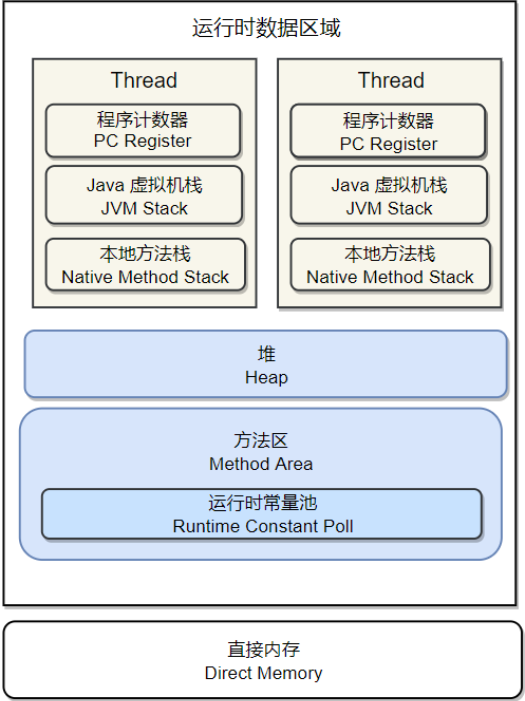
</div>

**线程私有**：

- 程序计数器：保存当前正在执行的线程的字节码的行号：控制循环，跳转，分支，异常处理等 唯一没有 OOM 
- Java 虚拟机栈：每一个方法都会对应一个栈帧，保存着局部变量表， 操作数栈，动态链接方法出口，一个方法的执行就对应着栈帧的入栈和出栈，
局部变量表存放着编译器可知的基本数据类型，对象的引用，returnAddress (执行字节码指令的地址)。虚拟机栈所需内存空间在编译器完成分配，
当请求栈的深度超过允许的深度，会抛出 StackOverFlow 异常，扩展时无法申请到足够的内存，会抛出 OOM。-Xss 指定 Java 虚拟机栈大小
- 本地方法栈：JVM 运行 Native 方法服务

**线程公有**：

<div align="center">
  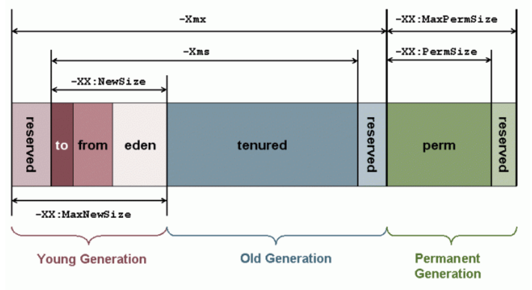
</div>

- 堆：保存对象的实例，垃圾收集的主要区域，又称 GC 堆。

分为新生代和老年代，新生代又分为 Eden，from Survivor, to Survivor，比例为 8:1，利用率达到 90%。划分的目的就是为了更好地回收内存。

Java 堆可以不是物理上连续的内存空间，就像我们的磁盘一样。
可以动态拓展，-Xms 和 -Xmx，指定最小和最大，当堆中没有内存完成实例分配，并且不能再动态拓展时，抛出 OOM

- 方法区：保存着类信息，常量，静态变量以及即时编译器编译后的代码，当无法满足内存分配的需要时，抛出 OOM

和堆一样不需要连续的内存，并且可以动态扩展，动态扩展失败一样会抛出 OutOfMemoryError 异常。

- 运行时常量池：是方法区的一部分，Class 文件中除了类版本，字段，方法，接口等描述信息，还有一项信息是常量池，用于存放编译期生成的各种字面量和符号引用

在 JDK 1.4 中新加入了 NIO 类，它可以使用 Native 函数库直接分配堆外内存（Native 堆），然后通过一个存储在 Java 堆里的 DirectByteBuffer 对象作为这块内存的引用进行操作。
这样能在一些场景中显著提高性能，因为避免了在 Java 堆和 Native 堆中来回复制数据。

**判断对象是否存活**：

- **引用计数法**：为对象添加一个引用计数器，当有一个地方引用时，计数器加一。GC 收集器请理掉那些值为 0 的对象

缺点：如果多个对象循环引用，值都不为 0，但已经访问不到他们，无法收集

- **可达性分析**：以 GC Roots 对象为起始点，向下搜索，走过的路成为引用链，那些没有关联到的对象将会被清除。

可作为 GC Roots 的对象：方法区类静态属性引用的对象，方法区中常量引用的对象，虚拟机栈中局部变量表引用的对象，本地方法栈中JNI(Native)服务引用的对象。

使用 OopMap(一个数据结构用来存放对象引用，在类加载之后会通过计算得出对象的引用)，结合 OopMap 可以进行快速的根枚举。

<div align="center">
  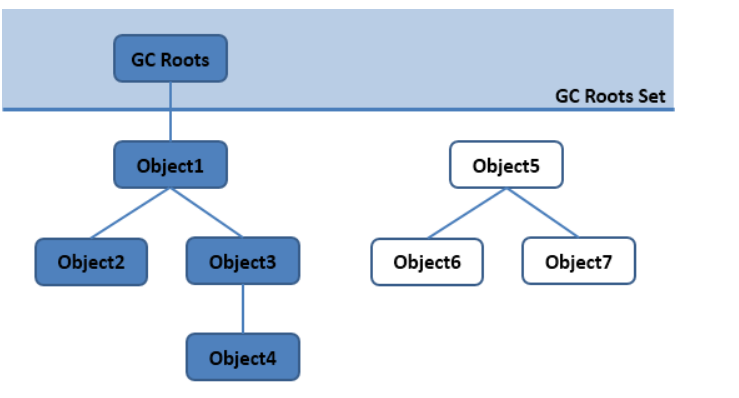
</div>

### 三色标记法(并发标记)

<div align="center">
  
</div>

- 白色：未被访问的对象
- 黑色：已经被访问过的对象
- 灰色：本对象已经被访问过，但本对象引用的其他对象还未被访问完

- 初始时，所有对象都在【白色集合】中
- 将 GC Roots 引用的对象挪到 【灰色集合】中。
- 从灰色集合中获取对象，将对象引用的其他对象放入【灰色集合】中，将本对象放入【黑色集合】
- 重复上一步，知道【灰色集合】为空。
- 回收位于【白色集合】的对象

**带来的问题**
- 多标：浮动垃圾。例如正在访问的灰色对象的一个引用被切断，那么本该被回收的对象被错误地标记，不会被回收，浮动垃圾不会影响系统的正确性

<div align="center">
  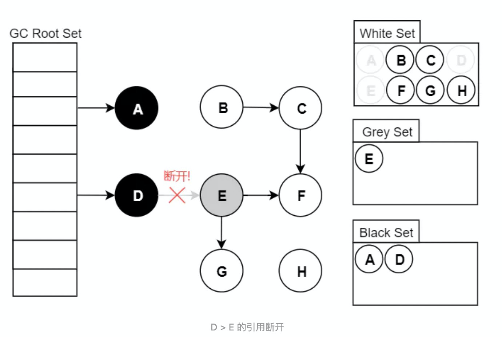
</div>

**解决方法**：成为浮动垃圾，需要等下一次垃圾收集时回收。

- 漏标：满足两个条件时会触发，灰色对象断开了白色对象的引用，黑色对象建立了与该对象的引用。结果会导致该白色对象不会被标记，被错误的回收。

```
Object G = objectE.fieldG;//读
objectE.fieldG = null;//写
objectD.fieldG = G;//写
```

**解决方法**：增量更新和原始快照 (SATB)(本质都是利用写屏障实现) 和写屏障，需要 STW。

- 写屏障 + SATB (G1 处理器使用)
当 `objectE.fieldG = null` 时，利用写屏障，将原有的对象记录下来，在并发扫描结束后，再将这些对象为根，重新再扫描一遍。思路是：保留原始 
GC Roots 的快照图，按照扫描开始那一时刻的对象图进行扫描。(破坏了条件：灰色对象断开了对白色对象的引用)

**优化**：如果不是处于并发标记阶段或者该对象已经被标记过，就不会再次标记了

- 写屏障 + 增量更新 (CMS 收集器)
当 `objectD.fieldG = G` 时，将新增的对象记录下来，之后再重新遍历。

<div align="center">
  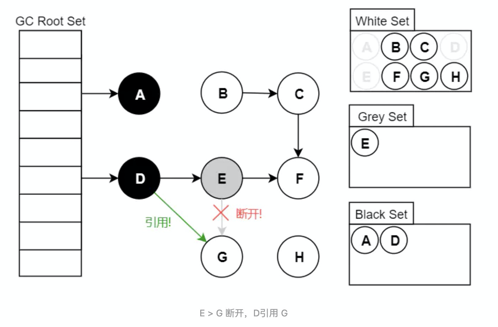
</div>

- 读屏障 (ZGC 收集器)
当 `Object G = objectE.fieldG` 时，记录下读取到的对象.

### 引用类型

强软弱虚

- 强引用：new xxx();不会被回收
- 软引用：内存不够被回收。
- 弱引用：存活到下一次 GC 之前。
- 虚引用：不会对对象的存活时间产生影响，也无法通过虚引用取得一个对象。
为一个对象设置虚引用的唯一目的就是这个对象在被回收时收到一个系统通知。

### 方法区的回收

主要是常量池的回收和对类的卸载。类卸载的条件：

1. 该类的所有实例已经被回收
2. 加载该类的 ClassLoader 已经被回收
3. 该类对应的 Class 对象没有在任何地方被引用，以及不能利用反射访问到该类的方法。

### finalize()方法

当一个对象可被回收时，如果需要执行 finalize() 方法，就有可能让该对象实现自救。该对象会被放置在一个叫做 F-Queue 的队列中，
稍后由一个虚拟机建立的 finalizer 线程去执行它。在第二次 GC 标记时，如果它关联到了 GC Roots,就实现了自救。只能调用一次。

对象在内存中布局：对象头，实例数据，对齐填充
对象头包括两部分：**Mark Word** 和 **类型指针**

### 对象的创建

1. 检查对应的类是否已经被加载，如果没有，加载这个类到方法区。
2. 根据加载的 Class 类对象创建实例对象，其所需的内存大小在类加载完成后可完全确定。
3.  如果堆内存有序，则通过 "指针碰撞" 分配，如果不连续，则通过维护一个空闲列表来维护可用空间，称为 "空闲列表"。多个线程同时申请内存时，可能会
出现线程安全问题，所以可以用 CAS 或者 在 TLAB(线程本地分配缓冲) 进行分配，分不下去再同步锁定。
3. 内存分配完成后，虚拟将分配到内存空间的实例数据部分初始化为零值。
4. 紧接着，虚拟机对对象的对象头进行必要的设置，如这个对象属于哪一类，如何找到类的元数据 (Class 对象)，对象的锁信息，
哈希码，GC 分代年龄等。之后，调用类的构造函数。

### 垃圾收集算法


**标记清除法**：标记所有需要回收的对象，标记完成后统一回收所有被标记的对象。

问题：效率不高，产生大量不连续的内存碎片，导致无法给大对象分配内存而提前触发 GC。

**复制算法**：将内存分为大小相等的两块，只使用其中的一块，在 GC 时将存活的对象复制到另一块上。

问题：内存利用率不高

现代虚拟机用此方法回收新生代，不同之处是将内存分为 Eden，To Survivor，From Survivor 比例为8:1:1,利用率为90%。

使用时使用 Eden 和 from Survivor，GC 时将存活对象复制到 to Survivor,清除掉 Eden 和 from Survivor。当 to Survivor 不够用，需要老年代进行空间担保

**标记整理法**：所有存活对象向一端移动，清除掉端边界以外的内存。

缺点：需要在移动对象的时候 STW，会暂停当前用户线程。关注吞吐量的收集器 Parallel Scavenge 使用的是标记-整理，关注延迟的
CMS 收集器使用的是 标记-清除。(不使用标记-整理是因为标记整理需要空间担保，老年代无法找到空间去担保)

**分代收集**：根据对象存活时间将内存区域分为几块，采用不同的收集算法。

一般将堆分为新生代和老年代。
- 新生代：**复制**算法
- 老年代：**标记-清除** 或 **标记-整理** 算法。

### 垃圾收集器

#### Remembered Set
记忆集，在新生代中建立，用以避免把老年代加入 GC Roots 扫描范围，解决对象跨代出现的问题。记录非收集区域到收集区域的指针集合。（缩减 GC Roots 
扫描范围）(我指向谁)

在 HotSpot 中，使用卡表(Card Table)来实现记忆集。卡表数组是一个字节数组，每一个元素都标识着内存区域中一个特定大小的内存块，称为 "卡页"。
其大小是 2 的 N 次幂，HotSpot 中是 2 的 9 次方，也就是 512 字节。当卡页中至少有一个对象存在跨代引用，则将卡页数组元素的值设置为 1，
称这个元素变脏。在垃圾收集时，只要筛选出卡表中变脏的元素，便可得出哪些卡页内存中存在跨代指针，将他们一起加入 GC Roots 一起扫描。

<div align="center">
  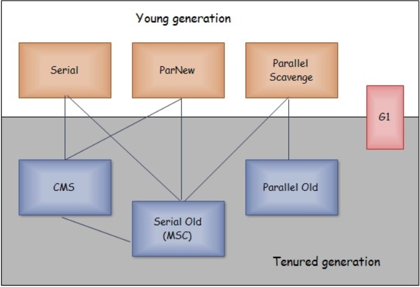
</div>

1. 单线程与多线程：单线程指垃圾收集器只使用一个线程进行收集，而多线程使用多个线程。
2. 串行与并行：串行指的是垃圾收集器与用户程序交替执行，意味着在执行垃圾收集的时候需要停顿用户线程；并行指的是垃圾收集器与用户程序同时执行。
除了 CMS 和 G1 之外，其他垃圾收集器都是以串行的方式执行。

#### Serial: 单线程，串行

<div align="center">
  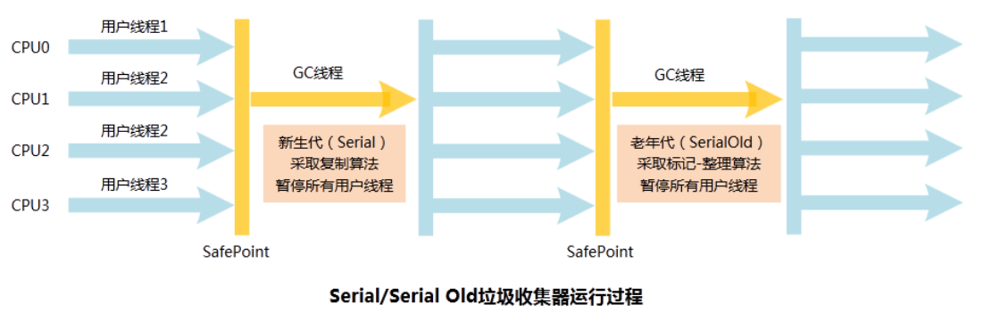
</div>

新生代采用复制算法，老年代（ Serial-Old 采用标记-整理）

它的优点是简单高效，是所有收集器中消耗额外内存最少的。对于单个 cpu 环境来说，由于没有线程交互的开销，因此拥有最高的单线程收集效率。
Client 模式下默认的新生带收集器。

#### parNew: Serial 收集器的多线程版本。

<div align="center">
  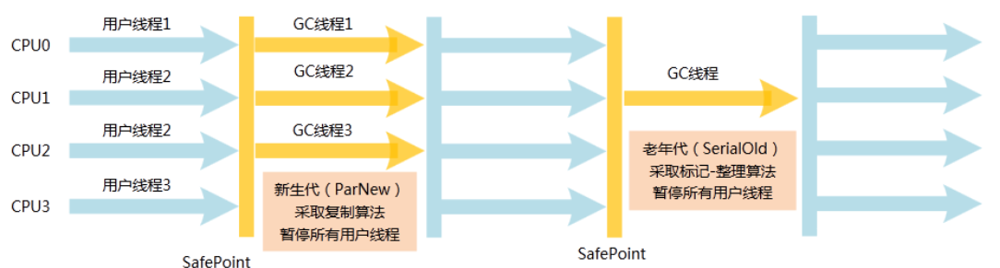
</div>

是 Server 模式下首选新生代收集器，除了性能，还是除了 Serial 外唯一能与 CMS 配合使用的收集器。

#### Parallel Scavenge 收集器

与 parNew 一样是多线程收集器 吞吐量优先，可以设置两个参数来控制吞吐量

- -XX:MaxGCPauseMillis：控制最大垃圾收集停顿时间，允许设值为一个大于 0 的毫秒数，收集器将尽力保证垃圾收集的时间不超过用户设定值。
但停顿时间的缩短是以牺牲新生代空间和牺牲吞吐量为代价。比如原来 10 秒收集一次，每次停顿 100ms，现在 5 秒收集一次，每次停顿 50ms。
- -XX:GCTimeRatio：0 到 100 的整数，用来设置垃圾收集时间占总时间的比例。

可以通过一个开关参数打卡 GC 自适应的调节策略（GC Ergonomics），就不需要手工指定新生代的大小（-Xmn）、Eden 和 Survivor 区的比例、晋升老年代对象年龄等细节参数了。

虚拟机会根据当前系统运行情况收集性能监控信息，动态调整这些参数，以提供最合适的停顿时间或最大的吞吐量，这种调节方式称为 GC 自适应的调节策略（GC Ergonomiscs） 。

#### Serial Old 收集器

Serial 的老年代版本，同样单线程，使用标记整理算法。用途：
- 搭配 Parallel Scavenge 使用
- 作为 CMS 失败后的后备预案，在并发收集发生 Concurrent Mode Failure 时使用。

#### Parallel Old 收集器

#### CMS收集器

**标记-清除**算法

优点：并发收集，低停顿

分为以下四个流程：
1. 初始标记：标记 GC Roots 能直接关联到的对象，速度很快，需要停顿。
2. 并发标记：进行 GC Roots Tracing 的过程，它在整个回收过程中耗时最长，不需要停顿。
3. 重新标记：为了修正并发标记期间因用户程序继续执行而导致的产生变动的对象的标记记录(增量更新)，需要停顿。
4. 并发清除：不需要停顿。

缺点：
1. 吞吐量低，低停顿是以牺牲吞吐量为代价，导致 cpu 利用率不高。
吞吐量 = 运行用户代码时间 / (运行用户代码时间 + 垃圾收集时间)
2. 无法处理浮动垃圾（并发标记和并发清除阶段用户程序继续运行产生的垃圾）由于浮动垃圾的存在，因此需要预留出一部分内存，
意味着 CMS 收集器不能像其他收集器等老年代快满再回收，如果预留的内存不够存放浮动垃圾，就会出现 Concurrent Mode Failure，
这时虚拟机将临时启用 Serial Old 代替 CMS。JDK6 时，CMS会在老年代使用了 92% 被激活。
3. **标记-清除**算法导致的空间碎片，往往出现老年代空间剩余，但无法找到足够大连续空间来分配当前的对象，不得不提前触发一次 Full GC。

#### G1收集器 (Garbage First)

<div align="center">
  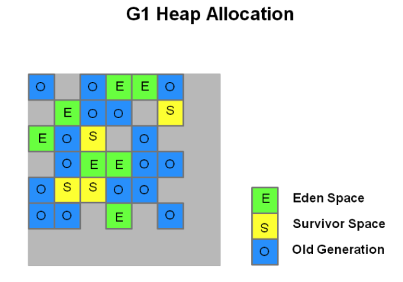
</div>

面向服务端应用的垃圾收集器，在多 CPU 和大内存的场景下有很好的性能。在低延迟的情况下尽量保证高吞吐量。

G1 可以直接对新生代和老年代一起收集。
G1 把堆分为多个大小相等的独立区域，新生代和老年代不再物理隔离。

1. 引入了 Region 的概念，将内存区域划分为多个的小空间，每个小空间单独进行垃圾回收，这种划分方法带来了很大的灵活性，使得可预测的停顿时间模型成为可能。
2. 通过记录每个 Region 垃圾回收时间以及回收所获得的空间（过去回收经验所得），并维护一个优先列表，每次根据允许的收集时间(-XX:MAXGCPauseMillis，默认为 200ms)，优先回收价值最大的 Region。
3. 每次回收会回收 Region 大小的整数倍，可通过 -XX: G1HeapRegionSize 指定(1MB - 2MB，且应为 2 的 N 次幂)
4. 跨 Region 的引用对象还是通过记忆集来实现，每个 Region 维护自己的记忆集，记录着其他 Region 指向自己的指针，并标记这些指针分别在哪些卡页的范围内。
(双向卡表)。由于每个 Region 会维护一个 记忆集，所以 G1 收集器更占内存。(堆内存的 10% 到 20%)
5. 保证并发标记阶段用户线程和收集线程互不干扰：写屏障 + SATB。
6. 回收过程中用户线程产生的新对象， G1 为每个 Region 设置了指针，用来进行新对象的内存分配，如果回收的速度赶不上新对象创建的速度，就会触发 full
gc。
7. 如果设置的停顿时间过少或者不合理，堆中内存堆积，最终会占满整个堆，造成 full gc。

- 初始标记：需要停顿，标记 GC Roots 能关联的对象，但是在 Minor GC 的时候同步进行的，所以停顿时间很少
- 并发标记：可达性分析，并记录 SATB
- 最终标记：需要停顿，处理 SATB 遗留的对象
- 筛选回收：需要停顿，更新 Region 的统计数据，对每个 Region 的回收成本和价值进行排序，然后将回收的那一部分 Region 的存活对象复制到空的 Region 中，
然后清理掉旧 Region 的全部空间

从整体来看，G1 使用的是标记-整理算法，从局部(Region 之间)来看，G1 使用的是标记-复制算法，性能瓶颈：每个 Region 维护记忆集，占内存和计算资源；
筛选回收阶段复制算法 STW，且随着存活对象的大小增加而增加。

**对比 CMS 收集器**
- G1 占用的内存会更多(每个 Region 需要维护一个记忆集)
- G1 的执行负载也更大
- 小内存使用 CMS 有优势，大内存使用 G1 更好

#### Shenandoah 收集器

- 摒弃了 G1 中耗费大量内存和计算资源维护的记忆集，改用连接矩阵，如果 Region 5 引用了 Region 3，则在 5 行 3 列 中打上标记。回收时通过连接矩阵的标记判断是否存在跨代引用。
- 处于收集性价比的考虑，默认不使用分代收集。所以不会有年轻代 Region 和老年代 Region，但会有 Humongous Region，用于存放大对象

1. 初始标记：和 G1 一样，首先标记与 GC Roots 直接关联的对象，与堆大小无关，和GC Roots 的数量有关，**需要停顿**
2. **并发标记**：和 G1 一样，与用户线程并发执行。
3. 最终标记：和 G1 一样，处理剩余 SATB 的扫描，并统计出回收价值较高的 Region，将这些 Region 构成一个回收集。**需要停顿**
4. 并发清理：用来清理那些一个存活都没有找到的 Region
5. **并发回收**：将回收集中的存活对象拷贝到未被使用的 Region。难点是拷贝的过程中用户线程可能不断地访问这个对象。解决方法：读屏障和转发指针。
运行时长取决于回收集的大小
6. 初始引用更新：将指向旧对象地址的指针指向新的对象地址的行为叫引用更新。初始引用更新就是设立一个线程集合点，确保对象已经复制成功了。**需要停顿**
7. **并发引用更新**：开始真正的引用更新
8. 最终引用更新：修正 GC Roots 的引用，**需要停顿**
9. 并发清理：此时回收集再无存活对象，再次调用并发清理收集

<div align="center">
  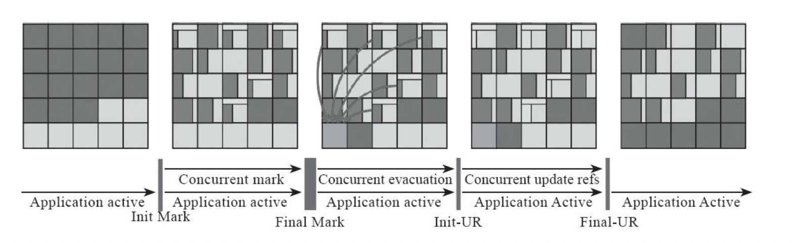
</div>

#### ZGC 收集器

基于 Region 的内存布局，将堆分为小型 Region(2MB)，中型 Region(32MB)，大型 Region(N * 2MB)。ZGC 使用**染色指针**和**读屏障**实现并发整理。

- 染色指针：传统的收集算法的标记阶段会将标记打在对象头中(Serial 收集器)或者独立的内存区域(G1, Shenandoah 使用 独立的数据结构BitMap)，
而 ZGC 直接将信息存储在了指针中。ZGC 仅支持 64 位系统，它把 64 位虚拟地址空间分为了多个子空间。在应用程序创建对象时，首先在堆空间申请一个虚拟地址，
但虚拟地址不会映射到真正的物理地址，ZGC 同时为对象在 M0，M1 和 Remapped 地址空间分别申请虚拟地址，对应相同的物理地址，同一时间只有一个空间有效。
ZGC 将对象存活信息存储在 42～45 位中。
<div align="center">
  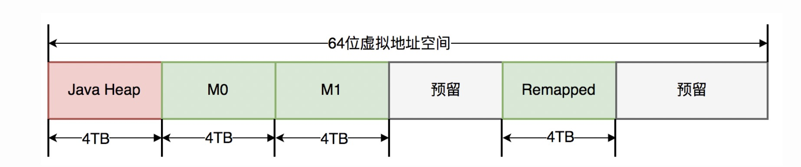
  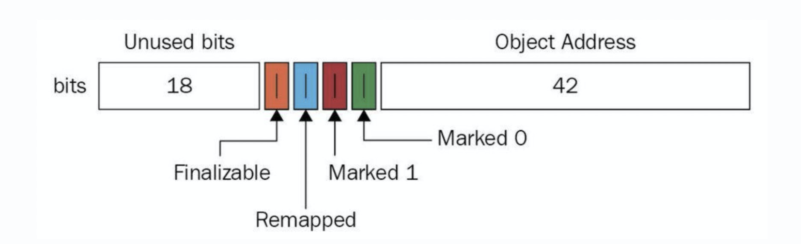
</div>

* 优点：一个 Region 只要存活对象被移走，就可以立即释放内存，不需要等待整个堆中指向该 Region 的引用被修正。

- 并发标记：和 G1 一样，遍历 GC Roots 进行可达性分析，停顿也相似。
- 并发预备重分配：根据特定的查询条件统计出本次收集过程中需要收集哪些 Region。
- 并发重分配
- 并发重映射

### 内存分配与回收策略

- Minor GC: 发生在新生代，频繁，快
- Full GC: 发生在老年代，不频繁，慢

#### 内存分配策略

1. 对象优先在 Eden 分配。Eden 空间不够，Minor GC。
2. 大对象直接进入老年代，例如长度很长的字符串，数组
3. 长期存活的对象进入老年代（默认 15 岁）
4. 动态对象年龄判定：Survivor 中相同年龄所有对象大小总和大于 Survivor 空间的一半，那年龄大于等于该年龄的对象可以直接进入老年代。
5. 空间分配担保，在发生 Minor GC 之前，虚拟机会检查老年代最大可用连续空间是否大于所有新生代对象总空间。，失败进行 Full GC。


#### Full GC 触发条件
1. 调用 System.gc(): 建议虚拟机 Full GC，但不一定会执行。
2. 老年代空间不足。老年代空间不足的常见场景为前文所讲的大对象直接进入老年代、长期存活的对象进入老年代等。
3. 空间分配担保失败。
4. JDK 1.7 及以前的永久代空间不足


### 类加载机制

1. 阶段：加载，连接（验证，准备，解析），初始化，使用四个阶段。因为 Java 语言本身支持运行时绑定，所以解析可以在初始化之后进行。
2. 类加载时机：new 一个对象时，访问一个类的静态字段，调用类的静态方法。

具体：

1. **加载**。通过一个类的全限定名获取此类的二进制字节流。
将这个字节流所代表的静态存储结构转化为方法区的运行时数据结构。
在内存中生成一个代表这个类的 `java.lang.Class` 对象，作为方法区这个类的各种数据的访问入口。

2. **验证**。文件格式验证：主要验证字节流是否符合 Class 文件格式规范，并且能被当前版本的虚拟机处理；
- 元数据验证：主要对字节码描述的信息进行语义分析，以保证其提供的信息符合 Java 语言规范的要求。（是否有父类，是否继承了不允许被继承的类，类中字段是否与父类产生矛盾。。。）
- 字节码验证：主要是通过数据流和控制流分析，确定程序语义是合法的，符合逻辑的。
3. **准备**。准备阶段的任务是为类或者接口的静态字段分配空间，并且默认初始化这些字段。不会执行任何的虚拟机字节码指令，在初始化阶段才会显式的初始化这些字段。
```
例：private static int value = 123;会被初始化为0
但是：private static final int constantValue = 123; 会被初始化为123；
```
4. **解析**。把常量池内的符号引用替换成直接引用的过程。（字节码中的指令转换为内存中的地址的指针）
5. **初始化**。执行静态变量的赋值操作以及静态代码块，按序执行。静态代码块中只能访问到定义在静态语句块之前的变量，定义在它之后的变量，只能赋值，不能访问。

6. **使用和卸载**

#### 类加载器

- 启动类加载器（Bootstrap ClassLoader）负责将 <JAVA_HOME>/lib 目录下类库加载到内存中。

- 拓展类加载器(Extension ClassLoader)，负责加载 <JAVA_HONE>/lib/ext 或 java.ext.dirs 系统变量指定的路径中的所有类库。

- 应用程序类加载器(Application ClassLoader)，负责加载 classpath 下的指定类库。没有自定义类加载器默认使用这个加载器。

- 自定义加载器：用户自定义，需要继承自 ClassLoader。

#### 双亲委派模型

如果一个类加载器收到类加载的请求，它首先不会自己尝试加载这个类，而是把这个请求委托给父类加载器完成，只有当父加载器无法加载，子加载器才会尝试自己加载。（避免程序员自己随意篡改系统类）

#### Java 的编译期优化与运行期优化

- 泛型与类型擦除（编译期优化）

Java 语言中的泛型在编译后的字节码文件中，就已经替换成原来的原生类型了

- 自动装箱，拆箱与遍历循环（编译期优化）

自动装箱，拆箱在编译之后被转换成对应的包装和还原方法。

#### 编译优化技术

- 公共子表达式清除
- 数组边界检查清除
- 方法内联
- 逃逸分析


