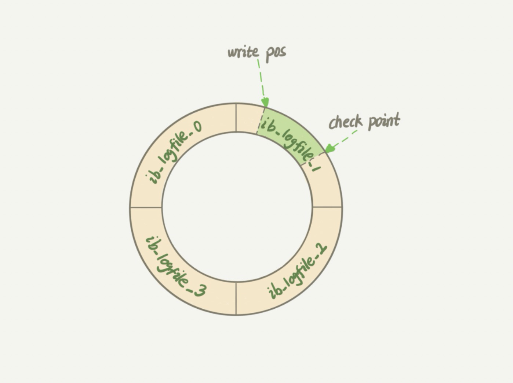
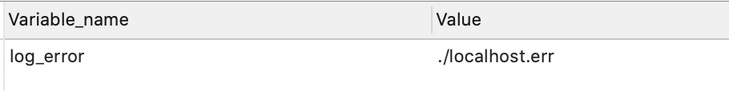
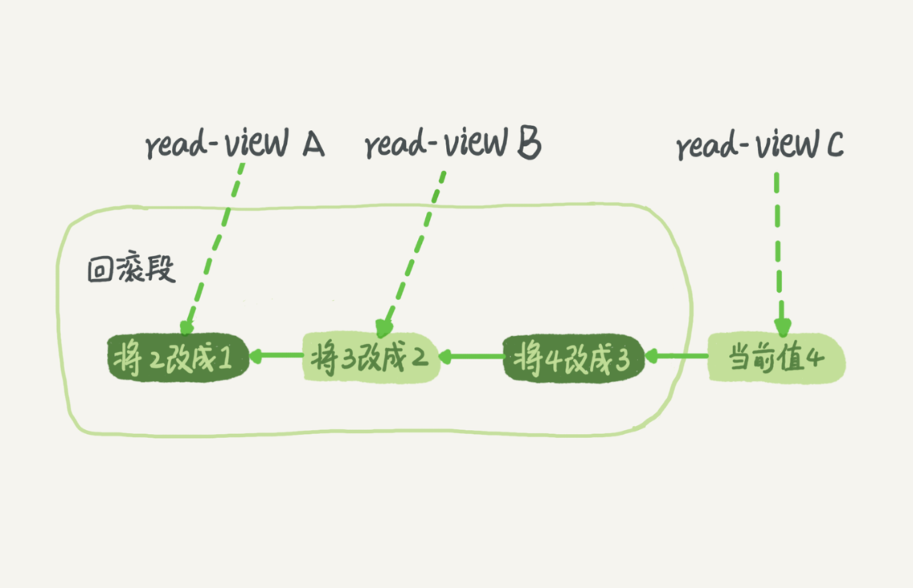

# MySQL

## 架构

<div align="center">
 
</div>

**mysql** 的架构图如图所示，其中分为

* server 层
    * 连接器
    * 分析器
    * 优化器
    * 执行器

- 存储引擎层


### 连接器

负责连接到数据库，与数据库建立连接，获取连接，维持和管理连接

```
mysql -h ip -u user -P port -p password
```

如果用户名或者密码不对，客户端会收到 "Access denied for user", 验证通过后连接器会到权限表中查找权限
(如果一个用户成功建立连接后，管理员对用户的权限做了修改，不影响现有的已经连接的权限)

查看连接状态可以用 show processlist 命令。

### 查询缓存

连接建立后，当执行 select 语句时，会先查询缓存，看下是否在之前执行
过这个语句，语句以 key-value 的形式缓存在内存中，key 是查询的语句，value 是查询的结果

**一般不建议使用缓存，因为缓存的命中率较低，当对表进行更新时，所有针对该表的缓存都会失效**

### 分析器

对于语句

```
select * from T where ID=10;
```

没有命中缓存，需要真正地执行 sql 语句，分析器会对语句进行分析，先做“词法分析”，从语句中识别表别名，列别名，即每个字符串代表什么含义，
例如，将 "select" 识别出来，这是一个查询语句，把 "T" 识别为表名，把 "ID" 识别为列名。之后会做语法分析，判断输入的语句是否满足MySQL语法。

### 优化器

在执行语句之前，优化器决定当表中有多个索引时走哪个索引，多表关联时决定各个表的连接顺序。

### 执行器

执行的时候，会判断用户对该表是否有执行的权限，如果没有，就会返回没有权限的错误，有权限则继续执行

## 日志

### redo log

<div align="center">
 
</div>

重做日志，用来记录数据页的物理改变，InnoDB 存储引擎专属。实现 MySQL 中的 WAL 技术，即 Write-Ahead Logging，先写日志，再写磁盘。包括两个部分，
redo log buffer 和 redo log file。redo log 通过循环写来记录变更，当文件满后，要先停下将 log 中变更写入磁盘，再继续更新，可以实现 crash-safe。

<div align="center">
 
</div>

#### redo log 写入机制

<div align="center">
  
</div>

在事务执行过程中，redo log 写入 redo log buffer 中，在事务没提交之前，不需要持久化到磁盘。但一个没有提交事务的 redo log 有可能被持久化到
磁盘。InnoDB 利用 `innodb_flush_log_at_trx_commit` 来控制 redo log 的写入。

- 设置为 0，表示每次事务提交都把 redo log 留在 redo log buffer 中。
- 设置为 1，表示每次事务提交直接把 redo log 持久化到磁盘。
- 设置为 2，表示每次事务提交都直接把 redo log 写到 page cache 中。

InnoDB 后台有个线程，每隔 1s 会将 redo log 调用 write 写到 文件系统的 page cache 中，再调用 fsync 持久化到磁盘。除此之外，还有两种情况会
写盘。

- 使用 redo log buffer 的大小超过 `innodb_log_buffer_size` 的一半，会调用 write 写盘。
- 如果 `innodb_flush_log_at_trx_commit` 设置为 1, 一个事务的提交会将 redo log 写盘，如果 buffer 中有未提交事务的日志，也会写盘。

如果将 `innodb_flush_log_at_trx_commit` 设置为 1，那么 redo log 在 prepare 阶段就要持久化一次。 由于后台线程每秒一次刷盘和崩溃恢复机制，
所以 redo log commit 阶段只需要 write 到page cache即可。

### binlog

归档日志，Server 层日志，每个存储引擎共享，逻辑日志，记录某行发生了什么改变。

* redo log 和 binlog 区别，为什么要有两个日志
  * redo log 是 InnoDB 特有的，可以实现 crash-safe，Server 层的 binlog 让所有引擎可以归档
  * redo log 是循环写(记录物理页的改变)，binlog 是追加写(记录行的改变)

对于一个 update 语句，MySQL 会先判断内存中是否有更新的相应行，没有就从磁盘加载，之后将更新后的新行更新到内存，将变更写入 redo log,
此时处于 prepare 状态，写入 binlog ，待事务提交后，将状态改为 commit。

<div align="center">
 
</div>

#### binlog 格式

- STATEMENT: 基于 sql 语句的复制
- ROW: 基于行的复制
- MIXED: 混合模式复制

#### 一次更新操作如何执行

由于 MySQL 的 WAL 机制， 所以一条更新语句在写入 redo log 就算完成了，之后的**事务提交采用两阶段提交**，让两个日志的状态保持一致。
如果先写 redo log 后写 binlog，如果 redo log 写完后系统崩溃，那么 binlog 会少一次更新的记录。
如果先写 binlog 后写 redo log，如果写完 binlog 后系统崩溃，redo log 还没有写，恢复后这个事务无效，用 binlog 会多出一次更新的记录，
与原库不一致，所以要采用两阶段提交。

崩溃回复时，如果写完 redo log 写 binlog 之前发生了崩溃，由于 binlog 还没写，事务会回滚； 如果 binlog写完，
redo log commit 时发生 crash， 如果崩溃恢复时 redo log 已经有 commit 标识， 则事务直接提交；如果 redo log 和 binlog 都存在且完整，
就提交事务， 否则就回滚事务。

#### binlog 写入机制

<div align="center">
  
</div>

一个事务在执行过程中，先把日志写入 binlog cache，在事务提交后，再将 binlog cache 写入 binlog 文件中。每个线程都有自己的 binlog cache，
但是共用同一份 binlog 文件。

- write: 把日志文件写到文件系统的 page cache 中，没有持久化到磁盘，速度很快。
- fsync: 将数据持久化到磁盘中，占用磁盘的 IOPS。

write 和 fsync 的时机是由参数 `sync_binlog` 来控制的：

1. sync_binlog = 0，表示每次提交事务，只 write，不 fsync。
2. sync_binlog = 1，表示每次提交事务，同时 write 和 fsync。
3. sync_binlog = N (N > 1)，表示每次提交事务都 write，累积 N 个事务后 fsync。
 
**将 sync_binlog 设置为 N，如果主机重启，最多可丢失 N 个事务的 binlog 日志**。

#### 双 "1" 配置

将 `sync_binlog` 和 `innodb_flush_log_at_trx_commit` 都设置为1，这样一次事务提交会有两次刷盘， redo log prepare 阶段和 binlog 写盘。

为了提高 IO 效率，InnoDB 使用组提交 (group commit)。如果多个并发事务都到达了 redo log prepare 阶段需要写盘，第一个到达的 trx1 会被选为 leader。
在写盘的时候，LSN(日志逻辑序列号, log sequence number) 已经有 trx1, trx2 和 trx3。trx1 写盘返回后，trx2 和 trx3 就可以直接返回了。
### undo log

回滚日志， 可以用来实现 MVCC 下的 read-view 视图。

### error log

```mysql
show variables like 'log_error';
```
<div align="center">
 
</div>

错误日志，查看日志位置
记录在启动，运行或者停止MySQL的过程中遇到的问题


### slow log

慢查询日志，记录所有执行时间超过 `log_query_time` 的查询语句或者不使用索引的查询

### relay log

中继日志，复制主服务器接收的数据更改

### general log

通用查询日志，记录建立的客户端连接和执行的语句

## 隔离级别

ACID(Atomicity, Consistency, Isolation, Durability)，原子性，一致性，隔离性，持久性。

多个事务会出现的问题：脏读，幻读，不可重复读，为了解决这些问题，有了隔离级别。不同的隔离级别，效率不同。

隔离级别 | 说明
---|---
读未提交 | 一个事务没有提交的变更可以被其他事务看到
读提交RC| 一个事务提交后，变更才会被其他事务看到
可重复读RR| 一个事务能看到的数据，与这个事务启动时看到的数据是一致的，默认的隔离级别，利用视图实现
串行化| 事务串行化执行，一个事务必须在另一个事务执行完成后才能执行，利用加锁

### 隔离级别的实现(MVCC)

  在 MySQL 中，每一条记录的更新都会有回滚日志，假设一个值1被按顺序改成了2，3，4，回滚日志就会记录相应的改动。
<div align="center">
 
</div>

  根据隔离级别的不同，同一条记录在系统中可能存在不同的版本，这就是MySQL的多版本并发控制(MVCC)。对于read-view A，需要将当前值一次进行回滚。
回滚日志在适当的时机会删除(认定没有事务需要到它们的时候，即当前系统中没有比这个回滚日志更早的read-view的时候)

## 事务

- `begin/start transaction` 显式开启，直到执行第一条语句时才真正启动事务，commit 提交事务(建议)。要想立即开启一个事务可以使用 
`start transaction with consistent snapshot`，可以立即开启一个一致性视图
- set autocommit=0，将当前线程的自动提交关掉，需要主动 commit/rollback
- 一致性视图：InnoDB 在实现 MVCC 时用到的一致性视图，用来支持RC和RR的隔离级别
- 更新数据时，使用当前读

### 快照的实现方式

  每次开启一个事务，MySQL 会为事务分配一个递增且唯一的事务 id，称为 transaction id，在更新数据时，会把当前 transaction id 赋给更新行的事务 id，
称为 row trx_id，而旧的数据版本也会保留，确保有其他事务可以拿到它。所以一行可以有多个版本(row)，每个版本都有自己的 trx_id，变更会保存在 undo log
中。

<div align="center">
  
</div>
  
  每次新开启一个事务，InnoDB 会创建一个视图数组，低水位是数组中事务 id 的最小值，当前系统中已创建事务 id 的最大值记为高水位。对于 row trx_id，如果
是在当前事务之前创建的或事务自身创建的事务，则可见(落在绿色区)；如果事务比当前事务 id 大，则不可见(落在红色区)；如果 row trx_id 在数组中(黄色)，
表示由未提交事务创建的，不可见，如果不在数组中，表示是由已经提交的事务产生的，可见。
- 可重复读：事务开始时创建一个一致性视图
- 提交读：每个语句执行时重新算出一个一致性视图
  
<div align="center">
  
</div>

## 索引

索引的出现为了提高查询效率，常见的索引数据结构有哈希表，有序数组和搜索树

- 哈希表:等值查找，缺点是不适合范围查找
- 有序数组:等值查找，范围查找，缺点是更新时较为麻烦
- 二叉搜索树:树高太高，查找磁盘次数为树高，可进一步优化为N叉树

InnoDB 的索引为 b+ 树，N 叉有序搜索树。根据索引类型，可以分为

- 主键索引(聚簇索引)，叶子节点中存的是整行数据
- 非主键索引(二级索引)，叶子节点中存的是主键的值

针对主键索引和普通索引进行查询，如果是主键进行查询的话，会直接查找聚簇索引对应的 b+ 树，而普通索引的话，需要先从二级索引对应的b+树找到相应的主键，
再回到主键索引 b+ 树中查找(除非使用了覆盖索引)

### 索引的维护

为了维护索引的有序性，当表记录发生改变时，对应的索引接口也会变化，当插入新值时，如果需要插入的位置所在的数据页已满(16 kb)，将涉及到页的分裂和合并。
选择索引时，主键长度越小，普通索引的叶子节点越小，普通索引占用的空间也就越小。

### 索引的优化

- 覆盖索引
如果一个二级索引的 b+ 树上已经有需要查找的记录，就无需通过**回表**来查找了，这样依赖可以减少树的搜索次数，显著提高性能。例如，在索引树上查找主键，
或者建立了一个联合索引(a,b)，利用 **select b from t where a = 'xxx'** 的方式可以使用到覆盖索引。
- 最左前缀匹配
- 索引下推
有个联合索引(a,b),如果使用 **select * from t where a like 'abc%' and b = 'hello'** 查询的话，虽然可以使用联合索引的 b+ 树，
但只能使用到 a，无法使用到 b，在回表时，MySQL 会先判断 b 是否等于 'hello'，如果不等于，就不会去回表，减少回表次数。

### 唯一索引和普通索引的区别

查询时，有于唯一索引的唯一性，所以只要查到一行便可返回，普通索引需要查到不满足条件的行为止。
更新数据页时，如果数据页在内存中，则直接更新内存，如果不在，InnoDB 会将更新缓存在 change buffer，下次将该数据页加载到内存中时再更新以提高效率。
change buffer 也可以持久化到磁盘，并且后台线程会定时将 change buffer 的更新应用到数据页(称为 merge)。数据库关闭时，也会 merge。对于唯一索引，
需要判断表中是否已经存在相同记录，所以需要加载数据页到内存，不会用到 change buffer。change buffer 使用的是 buffer pool 的内存，
可用 `innodb_change_buffer_max_size` 配置。

当要更新的数据页在内存，如要更新 id=2 的行，普通索引找到 1 到 3 之间的位置插入，而唯一索引还需要判断 1 到 3 之间有没有冲突，此时二者性能几乎相同；
当数据页不在内存中，唯一索引需要将所需要的数据页读入内存进行判断，而普通索引直接将更新记录在 change buffer，之后返回。change buffer
减少了随机磁盘 IO，会提升性能。
<div align="center">
  
</div>

**redo log 主要节省随机写磁盘的 IO 消耗， change buffer 主要节省随机读磁盘的 IO 消耗**

### 优化器选错索引

优化器在选择索引时，不仅要参考预计扫描的行数，还要考虑到 k 索引树回表，是否使用临时表，是否排序等等。可以使用 **force index(index_name)** 来指定索引
查询。可以使用
```
select * from t force index(a) where a between 10000 and 20000;
```

eg:
```
select * from t where (a between 1 and 1000) and (b between 50000 and 100000) order by b limit 1;
```
如果选择 a 作为索引，需要扫描 1000 行，选择 b 需要扫描 50001 行，但优化器考虑到选择 b 作为索引可以避免排序，所以选择了 b。

### 不走索引的情况

可能是优化器判断从索引树查找再回表的效率小于直接查找主键索引树，所以不走索引，还有可能是在索引字段上加了函数操作，那么也不会走索引

## 锁

### 分类

- 全局锁，对整个数据库进行加锁，`flush table with read lock`，将数据库设置为只读状态，一般用于库的备份
- 表级锁，对表加锁
- 行锁，对行加锁

### 表级锁

- 表锁
lock tables ... read/write，unlock tables 释放锁。

- 元数据锁 (Meta Data Lock, MDL),主要用来防止 DDL 和 DML 之间的并发冲突
不需要显示指定，访问一个表时被显式加上，用来保证读写的正确性。在 MySQL5.5 版本中引入了 MDL 锁，在**增删改查**的时候，加MDL读锁，
在对表结构做变更的时候，加MDL写锁。

* 读锁之前不互斥，读和写，写和写之前互斥。
* 当 MDL 写锁被阻塞，之后的 MDL 写锁也会被阻塞。

```
+-----+-----------------+-----------+------+---------+---------+---------------------------------+-------------------------+
| Id  | User            | Host      | db   | Command | Time    | State                           | Info                    |
+-----+-----------------+-----------+------+---------+---------+---------------------------------+-------------------------+
|   5 | event_scheduler | localhost | NULL | Daemon  | 8909941 | Waiting on empty queue          | NULL                    |
| 148 | root            | localhost | shop | Query   |       0 | starting                        | show processlist        |
| 154 | root            | localhost | shop | Query   |      11 | Waiting for table metadata lock | select * from t limit 1 |
| 155 | root            | localhost | shop | Query   |      42 | Waiting for table metadata lock | alter table t add f int |
+-----+-----------------+-----------+------+---------+---------+---------------------------------+-------------------------+
```

### 行锁

MySQL 的行锁由各个存储引擎自己实现，通过行锁可以提高业务并发度。在 InnoDB 的事务中，行锁在执行语句的时候才加上，在提交事务的时候释放。
如果一个事务中有需要锁多行，可以将并发度大的锁放在事务的后面。

#### 间隙锁

防止幻读的出现，间隙锁之间不冲突，只有在可重复读条件下才会生效

#### next-key lock

间隙锁和行锁合称 next-key lock，例如下图的记录，执行 `select * from t for update` 的时候，不止给数据库中已有的 6 个记录加了行锁，同时还加了
7 个间隙锁，这样来确保无法再插入新的记录。

#### 加锁规则

lock in share mode 只会对查询条件中的索引加锁，而 for update 会对主键索引也加锁

<div align="center">
  
</div>

#### 死锁

当两个事务都在等待对方释放自身的资源，就进入了死锁。

- 间隙锁会导致死锁的发生

处理策略：

- 进入锁等待，超过 `innodb_lock_wait_timeout` 后，超时释放锁
- 进行死锁检测(缺点是需要消耗额外的性能去判断是否出现死锁，造成CPU资源的消耗)

## MySQL 主从

### 主备一致

- 备库和主库会建立一个长连接。备库通过 change master 设置主库的 ip，端口号，用户名，密码，以及请求 binlog 的位置。
- 备库通过 start slave 命令成为 master 的备库，后台启动 io_thread 和 sql_thread， io_thread 与主库建立连接，sql_thread 处理请求。
- 主库校验完用户名和密码，从备库请求的位置开始发送 binlong 日志，备库收到后存入中转日志(relay_log)中， sql_thread 读取中转日志进行执行。

根据 binlog 格式的不同(statement, row, mixed), 日志中存放的内容也不相同。

## 常见问题

### binlog 能实现崩溃恢复么

binlog 记录的是行记录的变化，没有能力来恢复数据页

### 只用 redo log， 不用 binlog 可以么

redo log 是循环写，无法归档，并且在一些利用 binlog 来更新数据的场景如果不使用 binlog，将无法使用

### 某条查询语句突然变慢

InnoDB 使用 buffer pool 管理内存，在内存中有三种状态的数据页：脏页，干净页，未使用页。当查询时发现没有可用内存时，要把最久不使用的数据页置换掉，
如果该数据页是脏页，就需要将脏页先刷到硬盘，再加载新数据页。影响性能的有：
- 如果频繁刷脏页，会造成查询时间变长
- 日志写满，更新全部堵住，写性能为0

* 控制刷脏页参数：`innodb_io_capacity`，InnoDB 通过脏页比例 (`innodb_max_dirty_pages_pct`，默认75%) 和 redo log 写盘速度来算出一个比例
来控制刷盘速度。

**其他原因**

- 等待 MDL 锁

通过 `show processlist` 可以查看 当前的连接状态，通过 `select * from sys.shema_table_lock_waits` 来找到阻塞线程进行 kill。

- 等行锁的释放
- 没走二级索引，走了主键索引按顺序扫描

### 表记录删掉一半，表文件大小不变

InnoDB 利用 b+ 树来组织数据，当记录删掉后，对应的位置会被标为可复用，所以文件大小不会变。一个经过大量增删改查的表，有很多页会产生空洞，重建表可以
达到收缩表空间的目的。新建表后，数据页的使用会更紧凑，利用率页更高。

### count(*),count(1)和count(column)

- 由于 InnoDB 的 MVCC，每一行都要判断是否对当前会话可见，所以需要一行一行读取记录。
- count(*) 时，InnoDB 会选择最小的树来遍历，将所有行数返回，InnoDB 做了优化
- count(1) 时，InnoDB 会选择最小的树来遍历，将所有行都替换成1返回
- count(主键),将所有行的主键拿出返回

* count(字段) < count(主键 id) < count(1) ≈ count(*)
  
### 如何排序

使用 sort_buffer，其大小由 `sort_buffer_size` 来确定，如果空间不够需要使用外部临时文件采用归并排序来满足。在排序算法上，MySQL 优先将所有
查询的字段存到 sort_buffer 再排序，当空间不足以存放这些字段时，会将排序字段和主键放入 buffer 中排序，之后通过主键回表二次查找其他要返回的值。

### 更新一条语句时，如果要修改的值和原数据相同，还会执行么

当 MySQL 根据条件判断不需要修改时，就不会修改。例如在 `binlog_format=ROW` 并且 `binlog_row_image=FULL` 的条件下，MySQL 需要记录所有的
字段，所以需要将所有数据读出进行判断是否需要更新；但如果 `binlog_format=STATEMENT`,则只记录更新语句所以需要从查询条件推断是否需要更新。
```
> select * from t where id=2;
+----+------+------+
| id | a    | b    |
+----+------+------+
|  2 |    2 |    2 |
+----+------+------+

> update t set a=3 where id=2;  //不更新
> update t set a=3 where id=2 and a=3; //更新
```

### Explain 命令

```
+----+-------------+-------+------------+------+---------------+------+---------+-------+------+----------+----------------+
| id | select_type | table | partitions | type | possible_keys | key  | key_len | ref   | rows | filtered | Extra          |
+----+-------------+-------+------------+------+---------------+------+---------+-------+------+----------+----------------+
|  1 | SIMPLE      | t     | NULL       | ref  | a             | a    | 5       | const |    1 |   100.00 | Using filesort |
+----+-------------+-------+------------+------+---------------+------+---------+-------+------+----------+----------------+
```


