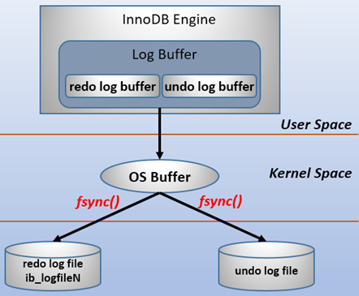

# MySQL

## 架构

 

**mysql**的架构图如图所示，其中分为

* server层
    * 连接器
    * 分析器
    * 优化器
    * 执行器

- 存储引擎层


### 连接器

负责连接到数据库，与数据库建立连接，获取连接，维持和管理连接

```
mysql -h ip -u user -P port -p password
```

如果用户名或者密码不对，客户端会收到"Access denied for user", 验证通过后连接器会到权限表中查找权限
(如果一个用户成功建立连接后，管理员对用户的权限做了修改，不影响现有的已经连接的权限)

查看连接状态可以用show processlist命令。

### 查询缓存

连接建立后，当执行select语句时，会先查询缓存，看下是否在之前执行
过这个语句，语句以key-value的形式缓存在内存中，key是查询的语句，value是查询的结果

**一般不建议使用缓存，因为缓存的命中率较低，当对表进行更新时，所有针对该表的缓存都会失效**

### 分析器

对于语句

```
select * from T where ID=10;
```

没有命中缓存，需要真正地执行sql语句，分析器会对语句进行分析，先做“词法分析”，从语句中识别表别名，列别名，即每个字符串代表什么含义，
例如，将 "select"识别出来，这是一个查询语句，把"T"识别为表名，把 "ID"识别为列名。之后会做语法分析，判断输入的语句是否满足MySQL语法。

### 优化器

在执行语句之前，优化器决定当表中有多个索引时走哪个索引，多表关联时决定各个表的连接顺序。

### 执行器

执行的时候，会判断用户对该表是否有执行的权限，如果没有，就会返回没有权限的错误，有权限则继续执行

## 日志

### redo log

 

重做日志，用来记录数据页的物理改变，InnoDB存储引擎专属。实现MySQL中的WAL技术，即Write-Ahead Logging，先写日志，再写磁盘。包括两个部分，
redo log buffer和 redo log file。redo log通过循环写来记录变更，当文件满后，要先停下将log中变更写入磁盘，再继续更新，可以实现crash-safe。

 

### binlog

归档日志，Server层日志，每个存储引擎共享，逻辑日志，记录某行发生了什么改变。

* redo log和 binlog区别，为什么要有两个日志
  * redo log是InnoDB特有的，可以实现crash-safe，Server层的binlog让所有引擎可以归档
  * redo log是循环写(记录物理页的改变)，binlog是追加写(记录行的改变)

对于一个update语句，MySQL会先判断内存中是否有更新的相应行，没有就从磁盘加载，之后将更新后的新行更新到内存，将变更写入redo log,
此时处于prepare状态，写入binlog，待事务提交后，将状态改为commit。

 

**事务提交采用两阶段提交**，让两个日志的状态保持一致。如果先写redo log后写binlog，如果redo log写完后系统崩溃，那么binlog会少一次更新的记录。
如果先写binlog后写redo log，如果写完binlog后系统崩溃，redo log还没有写，恢复后这个事务无效，用binlog会多出一次更新的记录，与原库不一致。

### undo log

### error log

错误日志，查看日志位置
```mysql
show variables like 'log_error';
```
 


### slow log

慢查询日志

### relay log

中继日志

### general log

查询日志

## 隔离级别

ACID(Atomicity, Consistency,Isolation, Durability)，原子性，一致性，隔离性，持久性。

多个事务会出现的问题：脏读，幻读，不可重复读，为了解决这些问题，有了隔离级别。不同的隔离级别，效率不同。

隔离级别 | 说明
---|---
读未提交 | 一个事务没有提交的变更可以被其他事务看到
读提交RC| 一个事务提交后，变更才会被其他事务看到
可重复读RR| 一个事务能看到的数据，与这个事务启动时看到的数据是一致的，默认的隔离级别，利用视图实现
串行化| 事务串行化执行，一个事务必须在另一个事务执行完成后才能执行，利用加锁

### 隔离级别的实现(MVCC)

  在MySQL中，每一条记录的更新都会有回滚日志，假设一个值1被按顺序改成了2，3，4，回滚日志就会记录相应的改动。
 

  根据隔离级别的不同，同一条记录在系统中可能存在不同的版本，这就是MySQL的多版本并发控制(MVCC)。对于read-view A，需要将当前值一次进行回滚。
回滚日志在适当的时机会删除(认定没有事务需要到它们的时候，即当前系统中没有比这个回滚日志更早的read-view的时候)

## 事务

- begin/start transaction显式开启，直到执行第一条语句时才真正启动事务，commit提交事务(建议)。要想立即开启一个事务可以使用
start transaction with consistent snapshot，可以立即开启一个一致性视图
- set autocommit=0，将当前线程的自动提交关掉，需要主动commit/rollback
- 一致性视图：InnoDB在实现MVCC时用到的一致性视图，用来支持RC和RR的隔离级别
- 更新数据时，使用当前读

### 快照的实现方式

  每次开启一个事务，MySQL会为事务分配一个递增且唯一的事务id，称为transaction id，在更新数据时，会把当前transaction id 赋给更新行的事务id，
称为row trx_id，而旧的数据版本也会保留，确保有其他事务可以拿到它。所以一行可以有多个版本(row)，每个版本都有自己的trx_id，变更会保存在undo log
中。

  
  
  每次新开启一个事务，InnoDB会创建一个视图数组，低水位是数组中事务id的最小值，当前系统中已创建事务id的最大值记为高水位。对于row trx_id，如果
是在当前事务之前创建的或事务自身创建的事务，则可见(落在绿色区)；如果事务比当前事务id大，则不可见(落在红色区)；如果row trx_id在数组中(黄色)，
表示由未提交事务创建的，不可见，如果不在数组中，表示是由已经提交的事务产生的，可见。
- 可重复读：事务开始时创建一个一致性视图
- 提交读：每个语句执行时重新算出一个一致性视图
  
  

  

## 索引

索引的出现为了提高查询效率，常见的索引数据结构有哈希表，有序数组和搜索树

- 哈希表:等值查找，缺点是不适合范围查找
- 有序数组:等值查找，范围查找，缺点是更新时较为麻烦
- 二叉搜索树:树高太高，查找磁盘次数为树高，可进一步优化为N叉树

InnoDB的索引为b+树，N叉有序搜索树。根据索引类型，可以分为

- 主键索引(聚簇索引)，叶子节点中存的是整行数据
- 非主键索引(二级索引)，叶子节点中存的是主键的值

针对主键索引和普通索引进行查询，如果是主键进行查询的话，会直接查找聚簇索引对应的b+树，而普通索引的话，需要先从二级索引对应的b+树找到相应的主键，
再回到主键索引b+树中查找(除非使用了覆盖索引)

### 索引的维护

为了维护索引的有序性，当表记录发生改变时，对应的索引接口也会变化，当插入新值时，如果需要插入的位置所在的数据页已满(16kb)，将涉及到页的分裂和合并。
选择索引时，主键长度越小，普通索引的叶子节点越小，普通索引占用的空间也就越小。

### 索引的优化

- 覆盖索引
如果一个二级索引的b+树上已经有需要查找的记录，就无需通过**回表**来查找了，这样依赖可以减少树的搜索次数，显著提高性能。例如，在索引树上查找主键，
或者建立了一个联合索引(a,b)，利用select b from t where a = 'xxx'的方式可以使用到覆盖索引。
- 最左前缀匹配
- 索引下推
有个联合索引(a,b),如果使用 **select * from t where a like 'abc%' and b = 'hello'** 查询的话，虽然可以使用联合索引的b+树，
但只能使用到a，无法使用到b，在回表时，MySQL会先判断b是否等于'hello'，如果不等于，就不会去回表，减少回表次数。

## 锁

### 分类

- 全局锁，对整个数据库进行加锁，flush table with read lock，将数据库设置为只读状态，一般用于库的备份
- 表级锁，对表加锁
- 行锁，对行加锁

### 表级锁

- 表锁
lock tables ... read/write，unlock tables释放锁。

- 元数据锁(Meta Data Lock, MDL),主要用来防止DDL和DML之间的并发冲突
不需要显示指定，访问一个表时被显式加上，用来保证读写的正确性。在MySQL5.5版本中引入了MDL锁，在**增删改查**的时候，加MDL读锁，
在对表结构做变更的时候，加MDL写锁。

* 读锁之前不互斥，读和写，写和写之前互斥。
* 当MDL写锁被阻塞，之后的MDL写锁也会被阻塞。

### 行锁

MySQL的行锁由各个存储引擎自己实现，通过行锁可以提高业务并发度。在InnoDB的事务中，行锁在执行语句的时候才加上，在提交事务的时候释放。
如果一个事务中有需要锁多行，可以将并发度大的锁放在事务的后面。

#### 死锁

当两个事务都在等待对方释放自身的资源，就进入了死锁。处理策略：

- 进入锁等待，超过innodb_lock_wait_timeout后，超时释放锁
- 进行死锁检测(缺点是需要消耗额外的性能去判断是否出现死锁，造成CPU资源的消耗)


