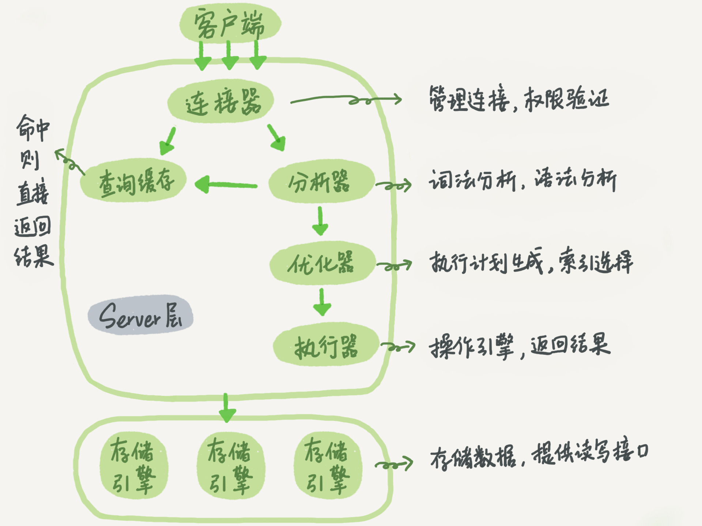

# MySQL

#### 架构


**mysql**的架构图如图所示，其中分为

* server层
    * 连接器
    * 分析器
    * 优化器
    * 执行器

- 存储引擎层


##### 连接器

负责连接到数据库，与数据库建立连接，获取连接，维持和管理连接

```
mysql -h ip -u user -P port -p password
```

如果用户名或者密码不对，客户端会收到"Access denied for user", 验证通过后连接器会到权限表中查找权限
(如果一个用户成功建立连接后，管理员对用户的权限做了修改，不影响现有的已经连接的权限)

查看连接状态可以用show processlist命令。

##### 查询缓存

连接建立后，当执行select语句时，会先查询缓存，看下是否在之前执行
过这个语句，语句以key-value的形式缓存在内存中，key是查询的语句，value是查询的结果

**一般不建议使用缓存，因为缓存的命中率较低，当对表进行更新时，所有针对该表的缓存都会失效**

##### 分析器

对于语句

```
select * from T where ID=10;
```

没有命中缓存，需要真正地执行sql语句，分析器会对语句进行分析，先做“词法分析”，从语句中识别表别名，列别名，即每个字符串代表什么含义，
例如，将 "select"识别出来，这是一个查询语句，把"T"识别为表名，把 "ID"识别为列名。之后会做语法分析，判断输入的语句是否满足MySQL语法。

#####优化器

在执行语句之前，优化器决定当表中有多个索引时走哪个索引，多表关联时决定各个表的连接顺序。

#####执行器

执行的时候，会判断用户对该表是否有执行的权限，如果没有，就会返回没有权限的错误，有权限则继续执行


