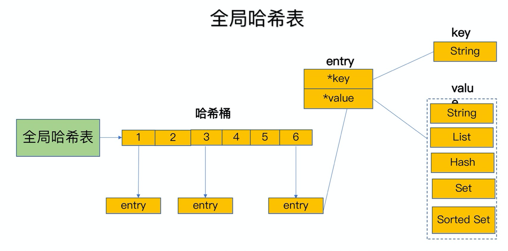
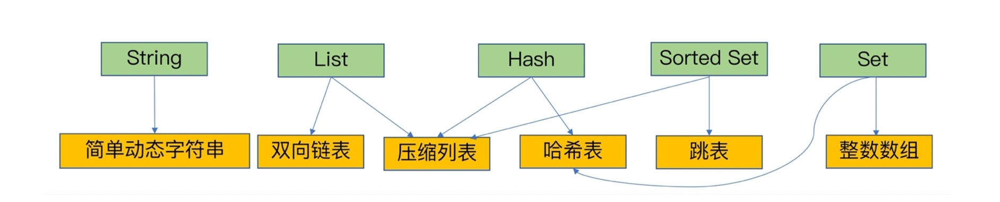
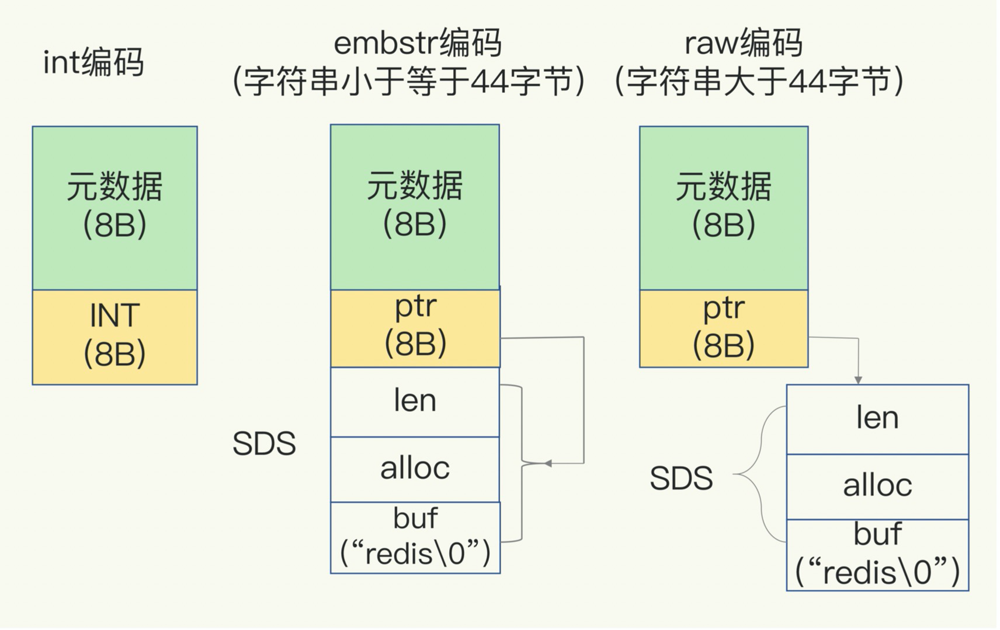
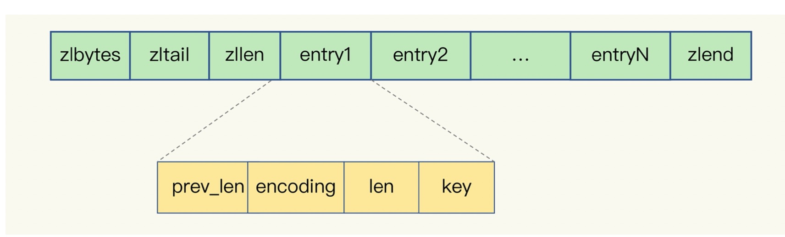

## 速度快原因

- 内存数据库，所有的数据操作都在内存中完成，本身就很快。
- 使用一个全局哈希表来保存 k-v 键值对，对 key 访问的时间复杂度可以达到 O(1)。解决冲突：链表法

## 单线程

redis 使用单线程处理 IO 请求以及数据读写，但其他功能，比如持久化，异步删除，集群数据同步时是有额外的线程来处理的。
在 redis 6.0 推出了多线程，在对客户端的读写使用多线程，提高 cpu 资源的利用率。

### 使用单线程原因

- redis 的瓶颈不在 cpu，而是内存与 IO
- 使用多线程有线程上下文切换的开销，以及对共享资源的并发处理问题。
- 单线程使用 IO 多路复用模型，对于 linux 系统使用 select/epoll机制，同时监听多个套接字，队列中处理。

### 单线程 IO 瓶颈

任意一个请求在 Server 中一旦发生耗时，都会影响这个 Server 的性能，后面的请求都要等到前面的耗时操作处理完成。耗时操作包括：
- 操作 bigkey: 写入一个 bigkey 在分配内存时需要更多的时间，同理，删除时释放内存也要消耗更多的时间。
- 使用时间复杂度过高的命令，比如 sort/sunion/zunionstore，或者 O(N) 命令，N很大。
- 大量的 key 集中过期，会导致线程删除过期 key 时耗时很多
- 淘汰策略：当淘汰 key 时，会造成耗时
- AOF 设置成 always 模式，每次写入都要刷新到磁盘
- 主从全量同步生成 RDB 文件： fork 子进程的过程中会耗时

### 哈希表的扩容

- 渐进式哈希：rehash 过程中如果一次性进行数据移，会造成线程阻塞无法处理其他请求，所以 redis 采用了渐进式哈希。
```
1. 创建一个容量是自身两倍的哈希表 2
2. 将哈希表 1 的数据重新映射到哈希表 2
3. 释放哈希表 1 的空间

```
- 每次处理请求，都将该索引位置的 entries 拷贝到新的 哈希表。没有新的请求时也会通过定时任务在 rehash，执行时长不超过 1ms。

时机：通过装载因子判断(entry的个数处以哈希桶的个数)，load factor >=1 时，如果没有 RDB 或 AOF，可以 rehash，load factor >=5 时，
立即 rehash。

## 数据类型

- 字符串  -> SDS
- 链表  -> ziplist + linkedlist 
- 集合  -> intset + hash
- 有序集合  -> skiplist + ziplist
- 哈希表  -> hash + ziplist

<div align="center">
  
</div>

### 使用场景

- 有序集合：排行榜，统计一段时间内的在线用户数。

### 底层数据结构

- 简单动态字符串
- 压缩列表 O(N)
- 双向链表 O(N)
- 哈希表 O(1)
- 跳表 O(logN)
- 整数数组 O(N)

<div align="center">
  
</div>

### 简单动态字符串(SDS)

```
struct sdshdr {
    //字节数组，保存字符串
    char buf[];
    //数组长度
    int len;
    //未使用长度
    inr free;
}
```
Redis 使用简单动态字符串来保存字符，好处：

- 获取字符串长度，时间复杂度为 O(1)
- 不会溢出，如果修改 SDS 时，空间不足，会先扩容，再修改（动态扩容）
- 减少内存分配的次数
- 二进制安全的

SDS 有三种编码方式，分别是 int, emdstr 和 raw。

redis 的所有对象都会被 RedisObject 封装，包括元数据和 ptr 指针。

- 如果保存的值为 Long 类型，指针直接赋值为整型数据；字符串小于等于 44 字节时，ptr 和 SDS 是一块连续区域，避免内存碎片，称为 embstr 编码方式；
如果大于 44 字节，会给 SDS 分配内存空间，并用 ptr 指针指向 SDS 结构，称为 raw 编码。

<div align="center">
  
</div>

### 压缩列表(ziplist)

<div align="center">
  
</div>

一种特殊编码，采用连续内存保存数据的数据结构，用于实现链表、哈希表，有序集合，非常节省内存空间。zlbytes 表示列表长度，zltail 表示列表尾的偏移量，
zllen 表示 entry 的个数，zlend 表示列表结束，默认用 255 表示列表结束。每个 entry 包括：

- prev_len: 表示前一个 entry 的长度，取值为 1 字节或者 5 字节。1 字节表示上个 entry 长度小于 254 字节，否则取 5 字节
- encoding：编码方式
- len：自身长度
- key：实际数据

- 使用压缩列表可以节省内存空间，但不宜过大（hash-max-ziplist-entries和zset-max-ziplist-entries不宜设置过大），否则查询性能会受到较大影响。

### bitmap

可以统计二值状态(0 / 1)，例如用户的签到统计，可以有效节省内存。底层使用 String 类型的数据结构，保存二进制的字节数组。
```
setbit user:123 1 1
getbit user:123 1
bitcount user:123
```

### HyperLogLog

HyperLogLog 是一种用于统计基数的数据集合类型，当集合元素非常多时，它所需的空间是固定的，每个 HyperLogLog 只需要花费 12KB，
就可以统计 2^64 个元素的基数。但 HyperLogLog 存在 0.81% 的误差，不适合精确计数。

```
pfadd page:uv user1 user2 user3
pfcount page:uv

pfmerge page1:uv page2:uv //得到两个页面 uv 总和
```

## 持久化

### AOF

日志追加，在写入数据后记录日志，所以不会阻塞当前的写操作。风险：写完命令后 redis 宕机，就会丢失数据。
apppendsync 参数
- Always: 同步写回，每个命令执行完，立即写会磁盘
- Everysec: 每次写完后，将日志写到 AOF 文件的内存缓冲区，每隔 1s 写回磁盘
- No: 不主动写磁盘，只写入缓冲区，由操作系统决定何时写盘

缺点：阻塞主线程、AOF文件内容过大时，追加写文件效率会变慢、发生宕机恢复时，AOF 记录的命令要重放，文件太大效率会变慢。

#### AOF 重写

如果对一个键频繁改动，会保存多个命令的日志，造成 AOF 文件过大。AOF 重写会根据当前 redis 的数据创建一个新的 AOF 文件，也就是读取每一个键值对，
用一条命令记录它的写入。

何时触发：
- 手动执行 bgrewriteaof 
- redis.conf 进行配置
```
auto-aof-rewrite-min-size 64MB // 当文件小于64M时不进行重写
auto-aof-rewrite-min-percenrage 100 // 当文件比上次重写后的文件大100%时进行重写
```

工作原理：
- redis 执行 fork()，同时拥有父进程和子进程
- 子进程将新 AOF 文件的内容写到临时文件
- 新的写入命令，父进程将其写入内存缓冲区，并追加到现有 AOF 文件中。所以过程中即使宕机，现有 AOF 是完整的
- 子进程完成写入后，父进程收到信号，将内存缓冲区的所有命令追加到新的 AOF 文件中
- 原子命令替换新旧文件，之后的命令都会追加到新的 AOF 文件

当主线程修改数据时，会把新数据或修改后数据写到一个新的物理内存地址，并修改主线程自身的内存映射。

fork() 原理：
- fork 子进程时会阻塞主线程，使用 Copy-On-Write 原则，只拷贝必须的数据结构，如主进程的页表，子进程指向与父进程相同的内存空间。

### RDB

内存快照，将内存中某一时刻的全部数据做备份

命令：
- save: 会阻塞当前主线程
- bgsave: fork 子进程来执行 RDB文件写入。

缺点：
- 如果频繁快照，会给磁盘造成很大压力
- 发生宕机时，最多会丢失两次快照时间间隔内的数据

优化：
- AOF 和 RDB 混用，两次快照之间，使用 AOF 记录期间的所有命令操作

## 主从同步

- 使用 slaveof(redis5.0 之后用 replicaof)

流程：
- 执行 slaveof 后，发送 psync 与主库同步，请求主库的 runId 和 复制进度 offset，主库返回 runId 和当前主库的 offset
- 主库执行 bgsave 生成 RDB 发给从库，新的写操作会记录在 replication buffer中。首次是**全量复制**，之后通过 offset 进行**增量复制**
- 主库将 replication buffer 中的数据发给从库。 

### 为什么传输不使用 AOF 文件

RDB是二进制文件，写磁盘或者传输时效率更快，在从库进行恢复后，用 RDB 的效率高于 AOF

### 主从网络断开

- 主库会将断连期间的写操作写入 replication buffer, 同时写入 repl_backlog_buffer 中。
- repl_backlog_buffer 是一个环形缓冲区，记录主库和从库的 offset，等从库重新连接后通过请求主库的参数 offset 来向从库继续发送数据。
- 环形缓冲区写满后会覆盖写，如果此时从库还没恢复会丢失数据，可以调整 repl_backlog_buffer 的大小

### replication buffer 和 repl_backlog_buffer 的区别

- 主库会创建客户端连接从库，每个从库对应一个客户端，客户端的buffer就是 replication buffer,各客户端不共享。
- repl_backlog_buffer 是一块专用 buffer，redis 启动后就一直接收读写请求，所有从库共享。主库从库会记录自己的复制进度。

### 主库挂了怎么办

哨兵机制：通常是多实例组成的集群，运行在特殊模式的 Redis 进程。它的任务是：监控(自己，主库，从库)，选主和通知。
- 监控：定时给主从库发送 PING 命令，检测是否在运行状态，如果在一定时间内没有恢复则标记为 "下线状态"
- 选主：如果主库挂了，进行选主操作
- 通知：通知其他从库 replicaof 新主库

#### 判断下线

- 主观下线：某个哨兵发现主库或从库 PING 响应超时，会标记为"主观下线"
- 客观下线：半数以上哨兵都判断某个库"主观下线"，该库会被标记为"客观下线"

#### 选主

- 如果某个哨兵发现主库"主观下线"，会向其他哨兵发送 is-master-down-by-addr 命令，其他哨兵根据主库的响应发挥 Y 或 N，
根据可配置项 quorum，判断是够客观下线。
- 所有从库，按照是否下线和网络连接状态筛选出可用从库，按照优先级，从库复制进度，从库 ID 号依次打分(ID号小的分数高)，某一轮胜出则被选为新主库

### 哨兵集群

- 基于 pub ｜ sub 模式，哨兵和主库建立连接后，可以发布自己的连接信息和订阅其他哨兵的连接信息
-当某个哨兵判读主库下线后，向其他哨兵 Leader 选举请求，选举自己为 leader，如果收到的赞成票超过半数并且大于等于 quorum，则选举成功

## 切片集群

如果一个 Redis 实例的数据量太大，fork 时间与数据量的大小成正比，长时间阻塞主线程，会使 Redis 的响应速度变慢
(可以使用 info 命令查看last_fork_sec 查看上次 fork 时间)，所以可以将收到的数据划分成多份，每份用一个 Redis 实例来保存。

Redis Cluster 方案可用来实现切片集群，采用哈希槽的方式，共有 16384 个槽，每个 key 会先通过 CRC16 算法计算得到 16bit 的值，再和 16384
取模，映射到对应的 Redis 实例中。分配哈希槽时，需要将 16384 个槽都分配完。

去中心化，每个实例需要有纠正客户端到正确节点的能力（MOVED 响应），所以节点之间会相互交换信息，每个节点具有整个集群的全部信息。

### 重定向

- 在集群中，新增或者删除 Redis 实例，需要重新分配哈希槽。
- 为了负载均衡，Redis 需要把哈希槽所在实例重新分配一遍

如果客户端缓存还记录着 Slot2 对应实例 2 的缓存，实际上 Slot2 已经迁移到了 实例 3，这时候客户端再访问实例 2 的时候，会返回 MOVED，
告诉客户端请求的键值在 实例 3 这个机器，这样客户端就可以让本地缓存失效，去实例 3 请求数据了。

如果 Slot2 正在向 Slot3 迁移，会收到 ASK 的指令，表示 slot 正在迁移中，并且返回对应的实例的地址，客户端需要给新的实例发送 ASKING，
再发送操作指令。